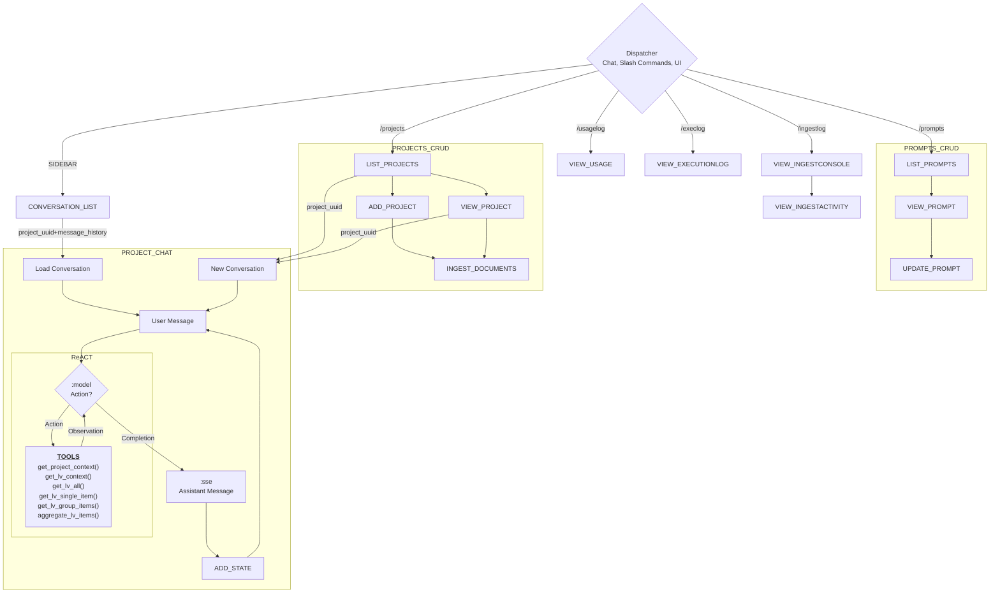

# UI Workflow

```mermaid
flowchart TD


        DISPATCHER{"Dispatcher<br />Chat, Slash Commands, UI"}

            CONVERSATION_LIST
            VIEW_USAGE
            VIEW_EXECUTIONLOG
            VIEW_INGESTCONSOLE
            VIEW_INGESTACTIVITY

            subgraph PROMPTS_CRUD

                LIST_PROMPTS --> VIEW_PROMPT
                VIEW_PROMPT --> UPDATE_PROMPT
            end

            subgraph PROJECTS_CRUD
                LIST_PROJECTS
                ADD_PROJECT
                VIEW_PROJECT
                INGEST_DOCUMENTS
                LIST_PROJECTS --> ADD_PROJECT
                LIST_PROJECTS --> VIEW_PROJECT
                ADD_PROJECT --> INGEST_DOCUMENTS
                VIEW_PROJECT --> INGEST_DOCUMENTS
            end

            subgraph PROJECT_CHAT
                A1[Load Conversation]
                A2[New Conversation]

                B1[User Message]

                E1[ADD_STATE]

                subgraph ReACT
                    C1{":model<br />Action?"}
                    C1 -->|Action|Tools

                    Tools["<b><u>TOOLS</u></b><br/>get_project_context()<br/>get_lv_context()<br/>get_lv_all()<br/>get_lv_single_item()<br/>get_lv_group_items()<br/>aggregate_lv_items()"]

                    Tools -->|Observation|C1

                end

                D1[":sse<br/>Assistant Message"]
                C1 -->|Completion|D1
                D1 --> E1
                E1 --> B1

                A1 --> B1
                A2 --> B1
                B1 --> C1
            end

            LIST_PROJECTS -->|project_uuid|A2
            VIEW_PROJECT -->|project_uuid|A2
            CONVERSATION_LIST-->|"project_uuid+message_history"|A1
            VIEW_INGESTCONSOLE --> VIEW_INGESTACTIVITY


        DISPATCHER -->|"/prompts"|LIST_PROMPTS
        DISPATCHER -->|"/projects"|LIST_PROJECTS
        DISPATCHER -->|"/usagelog"|VIEW_USAGE
        DISPATCHER -->|"/execlog"|VIEW_EXECUTIONLOG
        DISPATCHER -->|"SIDEBAR"|CONVERSATION_LIST
        DISPATCHER -->|"/ingestlog"|VIEW_INGESTCONSOLE

```
